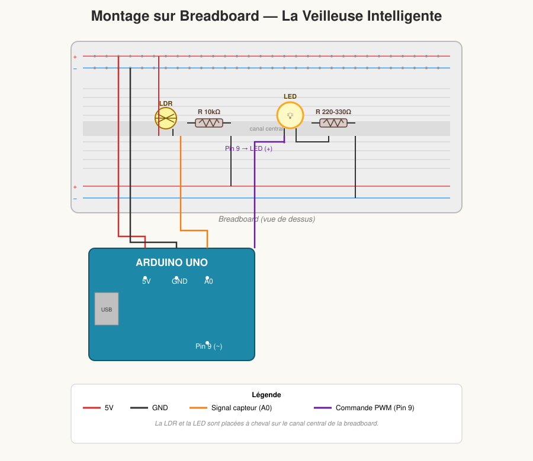
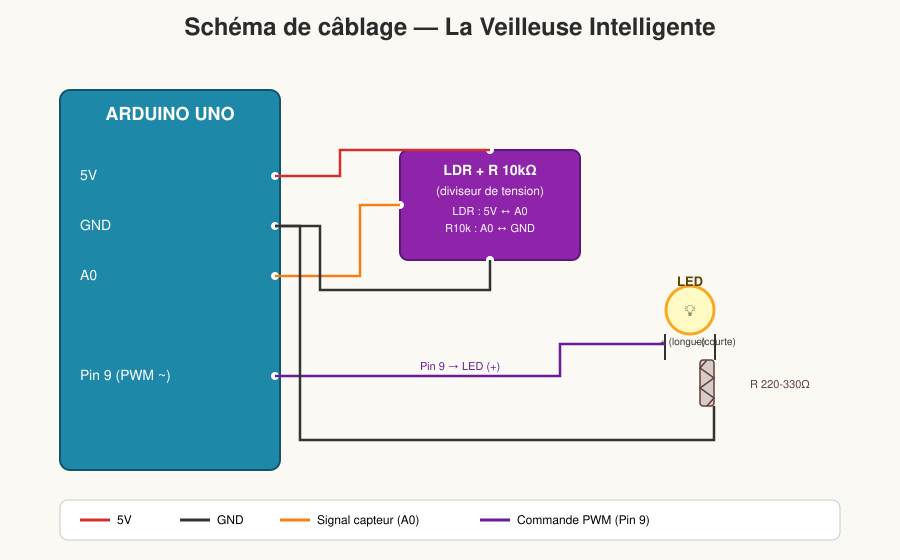

# 🌙 La Veilleuse Intelligente

Un montage Arduino simple et rapide à réaliser avec un enfant : une veilleuse qui s'allume automatiquement quand la lumière ambiante baisse, et dont l'intensité varie en douceur grâce au PWM.

---

## 🎯 Le Concept

Plus il fait sombre, plus la LED s'allume fort. Plus il y a de lumière, plus la LED s'éteint. La transition n'est pas brutale : elle est **progressive**, grâce à la modulation de largeur d'impulsion (PWM), ce qui rend le montage vivant et amusant à observer avec un enfant.

C'est un montage **beaucoup plus simple** que la station météo à écran LCD : moins de composants, moins de fils, résultat immédiat.

---

## 🧰 Le Matériel Nécessaire

| Composant | Rôle |
|---|---|
| 1 carte Arduino | Le cerveau du montage |
| 1 LED (couleur au choix) | La veilleuse elle-même |
| 1 résistance 220-330 Ω | Protège la LED |
| 1 photorésistance (LDR) | Capteur de lumière |
| 1 résistance de 10 kΩ | Complète le circuit du capteur (diviseur de tension) |
| Câbles Jumpers + Breadboard | Prototypage et connexions |

---

## 🔌 Le Schéma de Montage

### Vue breadboard (montage physique)



Le capteur LDR et la LED sont placés de chaque côté du canal central de la breadboard, alimentés par les rails +/− et reliés à l'Arduino par seulement 3 fils actifs (5V, A0, Pin 9) plus la masse.

### Vue schématique (câblage logique)



### Détail des connexions

**Le Capteur de lumière (LDR) :**
- Une patte ➡️ **5V** de l'Arduino
- L'autre patte ➡️ broche **A0** de l'Arduino
- Cette même patte ➡️ reliée au **GND** via la résistance de **10 kΩ**

**La LED :**
- Patte **longue** (borne `+`, anode) ➡️ broche numérique **9** de l'Arduino *(broche PWM, pour faire varier l'intensité)*
- Patte **courte** (borne `-`, cathode) ➡️ **GND**, en passant par la résistance de **220 Ω**

> 💡 On choisit la broche **9** car elle est compatible **PWM** (repérable par le symbole `~` à côté du numéro sur la carte Arduino), ce qui permet de faire varier progressivement la luminosité plutôt que juste allumer/éteindre.

---

## 💻 Le Code Arduino

```cpp
const int pinLDR = A0;  // Broche du capteur de lumière
const int pinLED = 9;   // Broche de la LED (compatible PWM)

void setup() {
  pinMode(pinLED, OUTPUT); // On dit à l'Arduino que la LED est une sortie
  // Pas besoin de configurer la LDR, les broches Analogiques (A0) sont des entrées par défaut
}

void loop() {
  // 1. Lire la luminosité (valeur entre 0 et 1023)
  int valeurLumiere = analogRead(pinLDR);

  // 2. Convertir la valeur pour la LED
  // Attention astuce : Si le capteur reçoit 1023 (plein soleil), on veut que la LED reçoive 0 (éteinte).
  // Si le capteur reçoit 0 (noir total), on veut que la LED reçoive 255 (allumée à fond).
  // On inverse donc les valeurs avec la fonction map() :
  int intensiteLED = map(valeurLumiere, 0, 1023, 255, 0);

  // 3. Envoyer l'ordre à la LED (valeur de 0 à 255)
  analogWrite(pinLED, intensiteLED);

  delay(20); // Petite pause pour stabiliser la lecture
}
```

### Explication rapide du code

- `analogRead(pinLDR)` lit la tension sur A0, qui varie selon la lumière reçue par la LDR (valeur entre 0 et 1023).
- `map(valeurLumiere, 0, 1023, 255, 0)` **inverse** l'échelle : une valeur haute de luminosité devient une valeur basse d'intensité LED, et inversement.
- `analogWrite(pinLED, intensiteLED)` envoie un signal PWM à la LED (valeur entre 0 = éteinte et 255 = intensité maximale).
- `delay(20)` stabilise la lecture sans ralentir la réactivité de la veilleuse.

---

## 🔬 Ce que l'enfant va apprendre

1. **Le concept d'inversion** : Pourquoi a-t-on inversé les chiffres dans le code (`0, 1023` devient `255, 0`) ? Parce que la veilleuse doit faire le **contraire** du soleil : quand le soleil se couche (valeur de lumière baisse), la veilleuse s'allume (valeur d'intensité monte).
2. **La variation d'intensité (PWM)** : Ce n'est pas juste "allumé" ou "éteint". En approchant doucement la main du capteur sans le toucher complètement, la LED va s'allumer très faiblement, puis de plus en plus fort — un bel effet à observer ensemble.

---

## 💡 Idées pour s'amuser avec l'enfant

1. **Le test de la main qui approche** : Faites approcher lentement une main au-dessus du capteur pour voir la LED s'allumer progressivement, sans à-coups.
2. **Simulation du coucher de soleil** : Diminuez très lentement la lumière de la pièce (rideau, interrupteur) et observez la veilleuse "réagir" en temps réel.
3. **Changer la sensibilité** : Modifiez les valeurs `0, 1023` dans le `map()` pour rendre la veilleuse plus ou moins sensible aux variations de lumière.
4. **Ajouter un seuil** : Pour aller plus loin, proposez à l'enfant de n'allumer la LED qu'en dessous d'un certain niveau de lumière (avec un `if`), plutôt qu'une variation continue.

---

## 🔧 Dépannage rapide

| Problème | Cause probable | Solution |
|---|---|---|
| La LED reste toujours éteinte | LED branchée à l'envers (patte longue/courte inversée) | Vérifier le sens de la LED (patte longue = `+`) |
| La LED reste toujours allumée à fond | LDR mal câblée (pas de diviseur de tension) | Vérifier que la résistance de 10 kΩ relie bien A0 au GND |
| La LED clignote de façon erratique | Mauvais contact sur la breadboard | Revérifier l'insertion des composants et des fils |
| La LED grille | Résistance 220-330 Ω absente ou mal placée | Toujours utiliser une résistance en série avec la LED |