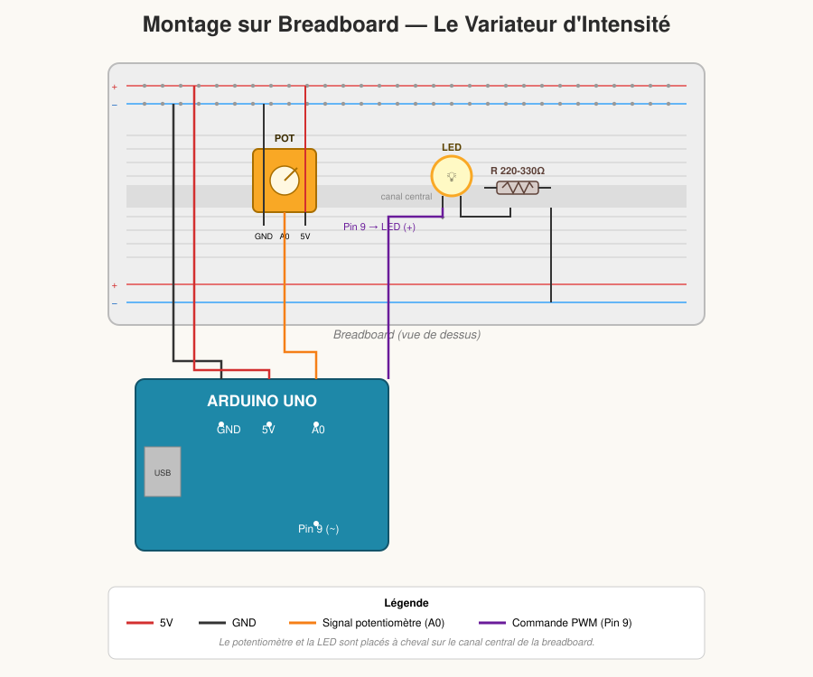
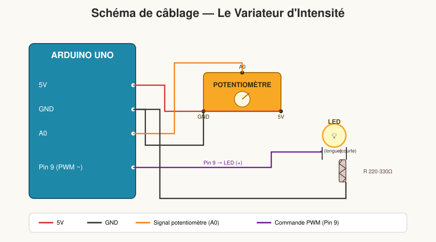

# 🔆 Le Variateur d'Intensité (Dimmer)

Le montage Arduino le plus simple et le plus rapide de la série : une LED dont la luminosité est contrôlée directement à la main, via un potentiomètre.

---

## 🎯 Le Concept

Quand on tourne le potentiomètre vers la **gauche**, la LED s'**éteint**. Plus on le tourne vers la **droite**, plus la LED **brille intensément**. Le contrôle est direct, immédiat et très satisfaisant pour un enfant : il voit tout de suite l'effet de son geste sur la lumière.

---

## 🧰 Le Matériel Nécessaire

| Composant | Rôle |
|---|---|
| 1 carte Arduino | Le cerveau du montage |
| 1 LED | La source lumineuse à contrôler |
| 1 résistance 220-330 Ω | Protège la LED |
| 1 potentiomètre | Réglage manuel de l'intensité |
| Câbles Jumpers + Breadboard | Prototypage et connexions |

---

## 🔌 Le Schéma de Montage

C'est un montage **très propre et rapide** à réaliser : seulement 2 composants actifs, aucun capteur de lumière.

### Vue breadboard (montage physique)



Le potentiomètre et la LED sont placés de chaque côté du canal central, alimentés par les rails +/− en haut et en bas.

### Vue schématique (câblage logique)



### Détail des connexions

**Le Potentiomètre :**
- Patte **gauche** ➡️ **GND** de l'Arduino
- Patte **droite** ➡️ **5V** de l'Arduino
- Patte **centrale** (le curseur) ➡️ broche analogique **A0**

**La LED :**
- Patte **longue** (borne `+`, anode) ➡️ broche numérique **9** *(compatible PWM)*
- Patte **courte** (borne `-`, cathode) ➡️ **GND**, en passant par la résistance de **220 Ω**

---

## 💻 Le Code Arduino

```cpp
const int pinPotentiometre = A0; // Le bouton rotatif est sur A0
const int pinLED = 9;            // La LED est sur la broche 9 (PWM)

void setup() {
  pinMode(pinLED, OUTPUT); // On indique que la broche 9 est une sortie
}

void loop() {
  // 1. On lit la position du potentiomètre (valeur entre 0 et 1023)
  int valeurPot = analogRead(pinPotentiometre);

  // 2. On adapte la valeur pour la LED (conversion de 0-1023 vers 0-255)
  int luminositeLED = map(valeurPot, 0, 1023, 0, 255);

  // 3. On allume la LED au niveau de puissance calculé
  analogWrite(pinLED, luminositeLED);

  delay(10); // Très courte pause pour la stabilité
}
```

### Explication rapide du code

- `analogRead(pinPotentiometre)` lit la position du curseur du potentiomètre (valeur entre 0 et 1023).
- `map(valeurPot, 0, 1023, 0, 255)` convertit cette valeur vers l'échelle attendue par `analogWrite()` (0 à 255).
- `analogWrite(pinLED, luminositeLED)` envoie un signal PWM à la LED pour régler son intensité en continu.
- `delay(10)` stabilise la lecture sans introduire de latence perceptible.

---

## 🧠 Le petit défi pour l'enfant (Pour aller plus loin)

Une fois que le montage fonctionne, proposez un petit jeu de programmation : **inverser le bouton !**

Demandez-lui : *"Comment faire pour que la LED soit allumée à fond quand le bouton est tourné à gauche, et s'éteigne quand on le tourne à droite ?"*

La solution tient dans une seule ligne, en inversant les bornes du `map()` :

```cpp
int luminositeLED = map(valeurPot, 0, 1023, 255, 0); // On a inversé 0 et 255 !
```

C'est une excellente manière de lui montrer l'impact direct d'une seule ligne de code sur un objet réel.

---

## 💡 Idées pour s'amuser avec l'enfant

1. **Le contrôle direct** : Laissez l'enfant tourner le bouton lui-même et observer l'effet instantané sur la LED.
2. **Le défi d'inversion** : Proposez le petit défi ci-dessus et laissez-le trouver où modifier le code.
3. **Vitesse de variation** : Changez la valeur du `delay()` pour voir si la réponse de la LED semble plus ou moins "fluide".
4. **Zone morte** : Demandez à l'enfant d'observer s'il y a une petite zone où tourner le bouton ne change rien visuellement (proche de 0 ou de 255) — bonne introduction à la notion de résolution.

---

## 🔧 Dépannage rapide

| Problème | Cause probable | Solution |
|---|---|---|
| La LED ne s'allume jamais | LED branchée à l'envers | Vérifier le sens de la LED (patte longue = `+`) |
| La LED reste toujours à la même intensité | Curseur du potentiomètre non branché sur A0 | Vérifier la patte centrale du potentiomètre |
| Variation saccadée plutôt que fluide | Mauvais contact sur la breadboard | Revérifier l'insertion des composants et des fils |
| La LED grille | Résistance 220-330 Ω absente ou mal placée | Toujours utiliser une résistance en série avec la LED |
