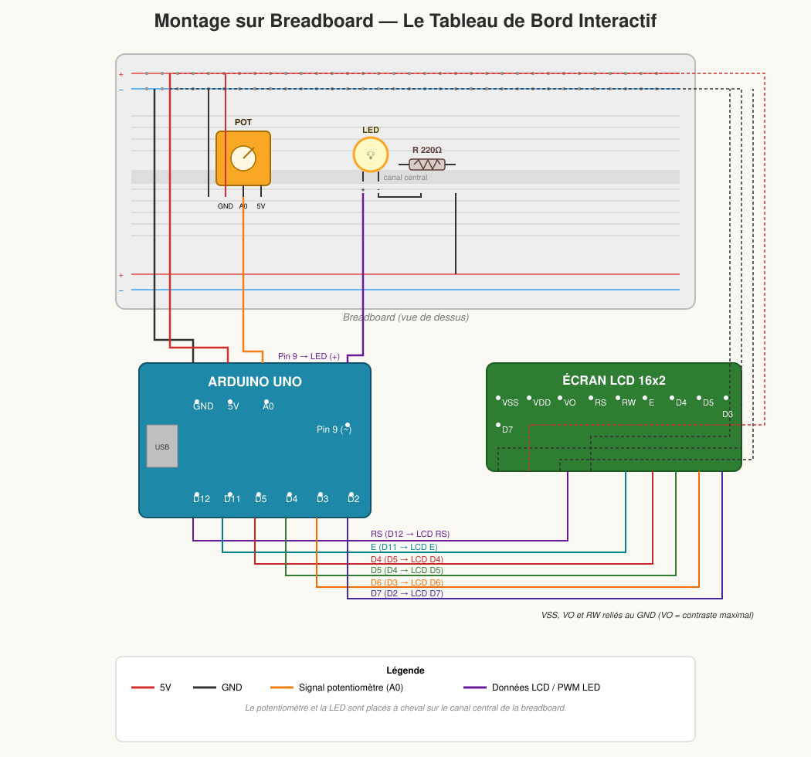
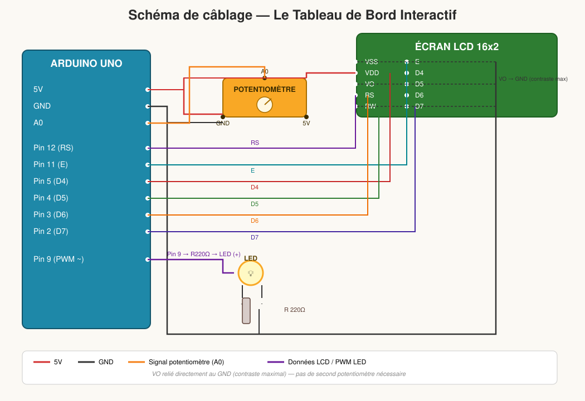

# 📊 Le Tableau de Bord Interactif

Le projet le plus complet de la série : il combine un **potentiomètre**, une **LED** et un **écran LCD** pour créer un vrai petit tableau de bord qui traduit un geste physique en texte compréhensible.

---

## 🎯 Le Concept

En tournant le potentiomètre, l'enfant contrôle à la fois :
1. **L'intensité d'une LED** (comme dans le Variateur d'Intensité), et
2. **Le texte affiché sur l'écran LCD**, qui traduit la position en pourcentage et en mot simple : *"Eteint"*, *"Eco (Doux)"*, *"Normal"*, ou *"MAXIMUM !!!"*.

C'est la synthèse des trois projets précédents dans un seul montage.

---

## 🧰 Le Matériel Nécessaire

| Composant | Rôle |
|---|---|
| 1 carte Arduino | Le cerveau du montage |
| 1 écran LCD 16x2 standard | Affichage du texte |
| 1 potentiomètre | Contrôle de la LED et du texte |
| 1 LED + résistance 220 Ω | Indicateur lumineux de puissance |
| Câbles Jumpers + Breadboard | Prototypage et connexions |

> 💡 **Note contraste** : Si vous avez un second potentiomètre, utilisez-le pour le contraste du LCD comme dans le projet de la Station Météo. Sinon, branchez simplement la broche **VO** du LCD directement au **GND** : le texte s'affichera avec un contraste maximal, ce qui fonctionne très bien dans la majorité des cas.

---

## 🔌 Le Schéma de Montage

### Vue breadboard (montage physique)



Le potentiomètre et la LED sont placés sur la breadboard, tandis que le VO du LCD est relié directement au rail GND (pas de second potentiomètre nécessaire).

### Vue schématique (câblage logique)



### Détail des connexions

**Le Potentiomètre :**
- Patte **gauche** ➡️ **GND**
- Patte **droite** ➡️ **5V**
- Patte **centrale** ➡️ broche analogique **A0**

**La LED :**
- Patte **longue** (`+`) ➡️ **Pin 9** (compatible PWM), en passant par la résistance de **220 Ω**
- Patte **courte** (`-`) ➡️ **GND**

**L'Écran LCD :**
| Broche LCD | Connexion |
|---|---|
| VSS | GND |
| VDD | 5V |
| VO (contraste) | GND *(ou second potentiomètre)* |
| RS | Pin 12 |
| RW | GND |
| E | Pin 11 |
| D4 | Pin 5 |
| D5 | Pin 4 |
| D6 | Pin 3 |
| D7 | Pin 2 |

---

## 💻 Le Code Arduino

```cpp
#include <LiquidCrystal.h>

// Initialisation de l'écran LCD (RS, E, D4, D5, D6, D7)
LiquidCrystal lcd(12, 11, 5, 4, 3, 2);

const int pinPot = A0;  // Le bouton rotatif
const int pinLED = 9;   // La LED

void setup() {
  lcd.begin(16, 2);
  pinMode(pinLED, OUTPUT);

  // Petit message d'allumage sympathique
  lcd.print("  SYSTEME LED  ");
  lcd.setCursor(0, 1);
  lcd.print("   INITIALISE   ");
  delay(2000);
  lcd.clear();
}

void loop() {
  // 1. Lire le potentiomètre (0 à 1023)
  int lecturePot = analogRead(pinPot);

  // 2. Convertir pour la LED (0 à 255)
  int puissanceLED = map(lecturePot, 0, 1023, 0, 255);
  analogWrite(pinLED, puissanceLED);

  // 3. Convertir en pourcentage pour l'affichage (0 à 100%)
  int pourcentage = map(lecturePot, 0, 1023, 0, 100);

  // 4. Affichage sur le LCD
  lcd.setCursor(0, 0); // Ligne 1
  lcd.print("Puissance: ");
  lcd.print(pourcentage);
  lcd.print("%  "); // Les espaces vident les anciens chiffres

  lcd.setCursor(0, 1); // Ligne 2

  // On écrit un mot différent selon la puissance
  if (pourcentage == 0) {
    lcd.print("Eteint          ");
  } else if (pourcentage > 0 && pourcentage < 40) {
    lcd.print("Eco (Doux)     ");
  } else if (pourcentage >= 40 && pourcentage < 80) {
    lcd.print("Normal          ");
  } else {
    lcd.print("MAXIMUM !!!     ");
  }

  delay(100); // Petite pause pour éviter que l'écran clignote trop vite
}
```

### Explication rapide du code

- `analogRead(pinPot)` lit la position du potentiomètre (0 à 1023).
- Deux conversions `map()` distinctes : une pour la LED (0-255), une pour l'affichage en pourcentage (0-100).
- `analogWrite(pinLED, puissanceLED)` pilote la LED en PWM.
- Le bloc `if / else if / else` choisit le mot à afficher selon la plage de pourcentage.

---

## 💡 Astuce de "Pro" à expliquer à l'enfant

Dans le code, on trouve des lignes comme `lcd.print("%  ");` avec des **espaces vides** après le symbole. C'est une astuce de magicien de l'informatique : quand on passe de **100%** (3 chiffres) à **9%** (1 chiffre), les espaces vides servent à **"effacer"** les vieux chiffres qui resteraient collés sur l'écran !

---

## 🎮 Idées pour s'amuser avec l'enfant

1. **Le tableau de bord vivant** : Laissez l'enfant tourner le potentiomètre et observer en même temps la LED et le texte changer.
2. **Personnalisation des mots** : Changez ensemble *"Eco (Doux)"*, *"Normal"*, *"MAXIMUM !!!"* par des mots inventés par l'enfant (par exemple *"Mode Ninja"*, *"Mode Fusée"*).
3. **Ajouter un seuil surprise** : Proposez d'ajouter une nouvelle tranche de pourcentage avec un message spécial, pour lui apprendre à ajouter une condition `else if`.
4. **Le défi du contraste** : Si un second potentiomètre est disponible, laissez l'enfant le régler lui-même et observer son effet sur la lisibilité du texte.

---

## 🔧 Dépannage rapide

| Problème | Cause probable | Solution |
|---|---|---|
| Écran totalement noir ou vide | VO non relié au GND (contraste maximal absent) | Vérifier que VO est bien câblé au GND |
| Le texte reste figé, ne change jamais | Potentiomètre mal câblé sur A0 | Vérifier la patte centrale du potentiomètre |
| La LED ne réagit pas au potentiomètre | Pin 9 mal branchée ou LED inversée | Vérifier le câblage de la LED et de la résistance |
| Anciens chiffres qui restent affichés | Espaces manquants après `lcd.print()` | Ajouter suffisamment d'espaces après le texte affiché |
