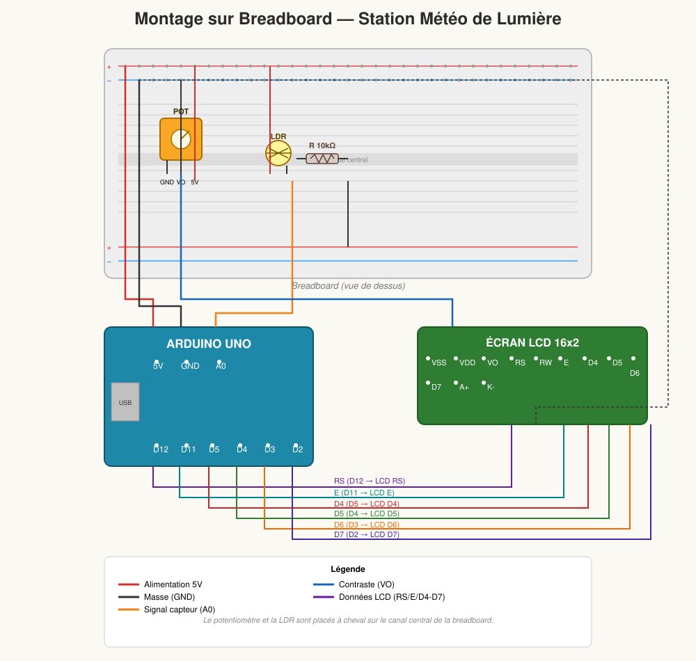
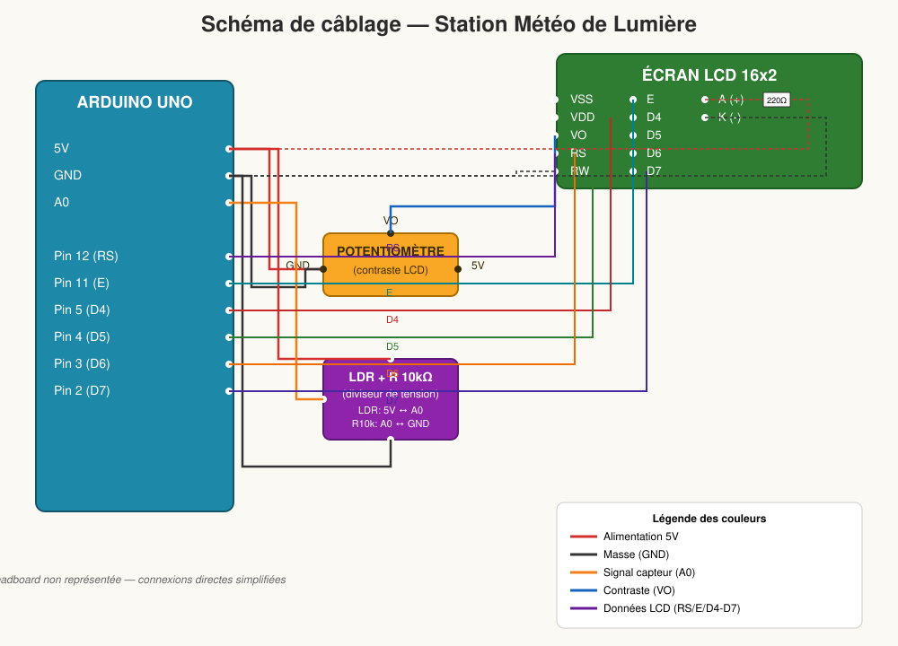

# 🌤️ La Station Météo de Lumière

Un projet Arduino simple et ludique pour initier un enfant à l'électronique : mesurer la luminosité ambiante et l'afficher sur un écran LCD avec des messages amusants.

---

## 🎯 Le Concept

1. **L'écran LCD** affiche la quantité de lumière dans la pièce, sous forme de pourcentage (0% à 100%).
2. Si on **cache le capteur**, l'écran affiche un message du type *"Il fait noir !"*. Si on **l'éclaire fortement**, il affiche *"Trop brillant !"*.
3. Le **potentiomètre** sert à régler le **contraste** de l'écran LCD, pour que le texte soit bien visible. C'est une étape cruciale : sans ce réglage, l'écran peut rester totalement noir ou bleu, sans aucun texte visible — source classique de frustration chez les débutants !

---

## 🧰 Le Matériel Nécessaire

| Composant | Rôle |
|---|---|
| 1 carte Arduino (Uno, Nano, etc.) | Le cerveau du montage |
| 1 écran LCD 16x2 (standard ou I2C) | Affichage des résultats |
| 1 photorésistance (LDR) | Capteur de lumière |
| 1 résistance de 10 kΩ | Complète le circuit du capteur (diviseur de tension) |
| 1 potentiomètre | Réglage du contraste de l'écran |
| Câbles Jumpers + Breadboard | Prototypage et connexions |

---

## 🔌 Le Schéma de Montage

### Vue breadboard (montage physique)



Cette vue représente le montage tel qu'il apparaît réellement sur la breadboard : le potentiomètre et la LDR sont placés à cheval sur le canal central, alimentés par les rails +/− en haut et en bas, avec les fils (jumpers) reliant l'Arduino et l'écran LCD.

### Vue schématique (câblage logique)



> ⚠️ **Note importante sur le LCD** : Ce schéma correspond à un écran LCD **standard** (sans module I2C). Si votre écran ne possède que **4 broches** à l'arrière, il utilise le protocole **I2C** — le câblage et le code sont alors différents (voir la section I2C plus bas).

### Le Potentiomètre (réglage du contraste)
- Broche **gauche** ➡️ GND
- Broche **droite** ➡️ 5V
- Broche **centrale** ➡️ broche **VO** (ou V0) de l'écran LCD

### Le Capteur de Lumière (LDR)
- Une patte ➡️ **5V**
- L'autre patte ➡️ broche **A0** de l'Arduino, **ET** reliée au **GND** via la résistance de **10 kΩ** (montage en diviseur de tension)

### L'Écran LCD (broches standard)
| Broche LCD | Connexion |
|---|---|
| VSS | GND |
| VDD | 5V |
| RS | Pin 12 |
| RW | GND |
| E | Pin 11 |
| D4 | Pin 5 |
| D5 | Pin 4 |
| D6 | Pin 3 |
| D7 | Pin 2 |
| A (Anode) | 5V (via résistance de 220 Ω) |
| K (Cathode) | GND |

---

## 💻 Le Code Arduino

```cpp
#include <LiquidCrystal.h>

// Initialisation de l'écran LCD avec les broches utilisées
// Syntaxe : LiquidCrystal(RS, E, D4, D5, D6, D7)
LiquidCrystal lcd(12, 11, 5, 4, 3, 2);

const int pinLumiere = A0; // Le capteur est branché sur la broche analogique A0

void setup() {
  lcd.begin(16, 2); // On dit à l'Arduino que l'écran fait 16 colonnes et 2 lignes
  lcd.print("Station Lumiere"); // Message de bienvenue
  delay(2000);
  lcd.clear();
}

void loop() {
  // Lecture de la valeur du capteur (entre 0 et 1023)
  int valeurBrute = analogRead(pinLumiere);

  // On transforme cette valeur en pourcentage (0% à 100%) pour l'enfant
  int pourcentage = map(valeurBrute, 0, 1023, 0, 100);

  // On efface l'écran pour mettre à jour les données
  lcd.clear();

  // Ligne 1 : Affichage du pourcentage
  lcd.setCursor(0, 0); // Colonne 0, Ligne 1
  lcd.print("Lumiere: ");
  lcd.print(pourcentage);
  lcd.print("%");

  // Ligne 2 : Petit message rigolo selon la luminosité
  lcd.setCursor(0, 1); // Colonne 0, Ligne 2
  if (pourcentage < 30) {
    lcd.print("Il fait noir !  ");
  } else if (pourcentage >= 30 && pourcentage < 70) {
    lcd.print("Lumiere douce :)");
  } else {
    lcd.print("Trop brillant ! ");
  }

  delay(500); // On attend une demi-seconde avant de recommencer
}
```

### Explication rapide du code

- `analogRead(pinLumiere)` lit la tension sur A0, qui varie selon la lumière reçue par la LDR (valeur entre 0 et 1023).
- `map(...)` convertit cette valeur brute en un pourcentage facile à comprendre (0-100%).
- `lcd.clear()` + `lcd.setCursor()` permettent de rafraîchir l'affichage à chaque boucle.
- Le `if / else if / else` choisit le message à afficher selon le niveau de luminosité.

---

## 🔄 Alternative : Écran LCD avec module I2C

Si votre écran n'a que 4 broches (GND, VCC, SDA, SCL), remplacez le câblage et le code par :

**Câblage I2C :**
- GND ➡️ GND
- VCC ➡️ 5V
- SDA ➡️ A4 (Arduino Uno/Nano)
- SCL ➡️ A5 (Arduino Uno/Nano)

**Code (nécessite la bibliothèque `LiquidCrystal_I2C`) :**

```cpp
#include <Wire.h>
#include <LiquidCrystal_I2C.h>

// L'adresse 0x27 est la plus courante, mais peut être 0x3F selon le module
LiquidCrystal_I2C lcd(0x27, 16, 2);

const int pinLumiere = A0;

void setup() {
  lcd.init();
  lcd.backlight();
  lcd.print("Station Lumiere");
  delay(2000);
  lcd.clear();
}

void loop() {
  int valeurBrute = analogRead(pinLumiere);
  int pourcentage = map(valeurBrute, 0, 1023, 0, 100);

  lcd.clear();
  lcd.setCursor(0, 0);
  lcd.print("Lumiere: ");
  lcd.print(pourcentage);
  lcd.print("%");

  lcd.setCursor(0, 1);
  if (pourcentage < 30) {
    lcd.print("Il fait noir !  ");
  } else if (pourcentage >= 30 && pourcentage < 70) {
    lcd.print("Lumiere douce :)");
  } else {
    lcd.print("Trop brillant ! ");
  }

  delay(500);
}
```

Avec l'I2C, pas besoin de potentiomètre : le contraste se règle via une petite vis bleue sur le module I2C.

---

## 💡 Conseils pour s'amuser avec l'enfant

1. **Le test du potentiomètre** : Une fois le circuit allumé, faites tourner le potentiomètre. L'enfant verra les rectangles du LCD apparaître et disparaître — expliquez-lui que c'est comme "les lunettes de soleil" de l'écran.
2. **Le jeu de l'ombre** : Demandez-lui de mettre sa main au-dessus du capteur pour essayer d'atteindre exactement **0%** (le mode "Nuit totale").
3. **Le test de la lampe de poche** : Utilisez le flash d'un téléphone pour faire grimper le score à **100%**.
4. **Personnalisation** : Changez ensemble les phrases dans le code — par exemple, remplacer *"Il fait noir !"* par *"Mode Vampire 🧛‍♂️"*.

---

## 🔧 Dépannage rapide

| Problème | Cause probable | Solution |
|---|---|---|
| Écran totalement noir ou bleu, sans texte | Contraste mal réglé | Tourner le potentiomètre |
| Valeurs toujours à 0% ou 100% | LDR mal câblée ou résistance manquante | Vérifier le montage en diviseur de tension |
| Rien ne s'affiche du tout | Alimentation ou branchements RS/E/D4-D7 incorrects | Revérifier chaque broche du tableau de câblage |